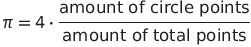

# How to approximate Pi

This program uses the python package `random` to generate a million point with x and y coordinates that oscillates between 0 and window size.  
During this process every point drawn is being checked to see if it is part of the inscribed circle in window square.\
After the points amount reaches the pre defined limit, the program calculates a discrete approximation of Pi.

This approximation consists in the evaluation of the circle-square area ratio with amount of circle points-amount of total points ratio. With this equation the Pi can be approximated and calculated as 

## Demo

